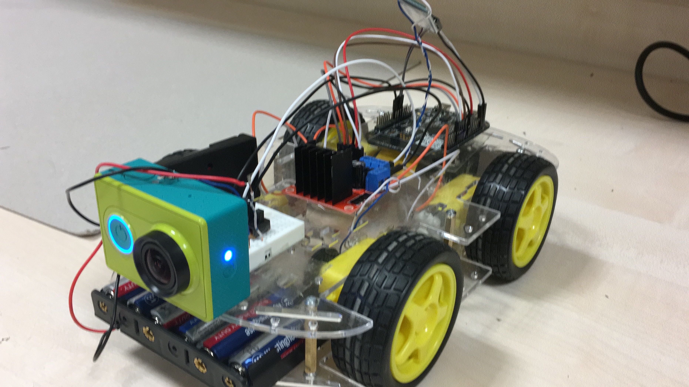

# Hand Gesture Controlled VR Remote Car

Demo video: 
[Hand Gesture Controlled VR Remote Car](https://youtube.com/shorts/HPI0GBkq9cU?si=BJlQORSSjnq1my4r)

## Introduction
The Hand Gesture Controlled VR Remote Car project aims to develop a vehicle controlled by hand gestures, enhanced with a VR camera for an immersive experience. Through a combination of gyroscopes, accelerometers, and Bluetooth communication facilitated by Arduino Uno and FRDM-KL25Z boards, users can control the car's movements via intuitive hand gestures. The integration of an action camera allows real-time video streaming to a smartphone connected to VR glasses, enhancing user immersion.

## Design Specification Plan
The project utilizes a 4WD robot car chassis equipped with four servo motors for wheel movement. Components including FRDM-KL25Z, a motor driver, battery, and Bluetooth receiver are integrated onto the chassis to manage vehicle dynamics based on user gestures. The hand gesture control system consists of an Arduino, gyroscopes/accelerometers, and a transmitter Bluetooth module, establishing communication with the car through a Master-Slave Bluetooth configuration.
For gesturing, if the users hold their hand level, there is no signal present, so the car does not move. Tilting the hand forward means acceleration for the car which makes the car move forward. Conversely, tilting the hand backward means rear acceleration, which makes the car move backward. If the users tilt their hand clockwise, only the left 2 wheels work so the car steers to the right and vice versa for the counterclockwise motion. Finally, an action cam is installed on the car and the video feed is streamed over its wireless network, with its smartphone application. The sensors and modules are all programmed with Embedded-C Language, on the FRDM-KL25Z and Arduino Uno. 

Users can control the car through specific hand gestures:
* Holding the hand level maintains the car stationary.
* Tilting the hand forward accelerates the car forward.
* Tilting the hand backward initiates reverse motion.
* Clockwise hand tilt steers the car to the right, while counterclockwise motion steers it left.

## Required Peripherals
*	FRDM-KL25Z Board 
*	Arduino Uno
*	2 * HC-05 Bluetooth Modules
*	MPU6050 Gyroscope/Accelerometer
*	4 * SG90 Servo Motors with Wheels
*	L298N Dual DC Motor Driver
*	Battery
*	Jumpers
*	LEDs
*	Glove
*	Action Cam
*	VR Glasses
*	4WD Car Chassis 
